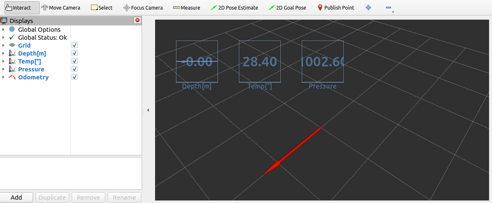

# ms5837_bar_ros

[](https://github.com/tasada038/ms5837_bar_ros/stargazers/)
[](https://github.com/tasada038/ms5837_bar_ros/network/)
[](https://github.com/tasada038/ms5837_bar_ros/issues/)

## Overview

ROS 2 package for Blue Robotics Bar30 and Bar02 High Resolution Depth/Pressure Sensor

**Keywords:** ROS 2, Bar30, Bar02

### License

The source code is released under a [MIT license](LICENSE).

## Requirements
[Bar30 High-Resolution 300m Depth/Pressure Sensor](https://bluerobotics.com/store/sensors-sonars-cameras/sensors/bar30-sensor-r1/)

[Bar02 Ultra High Resolution 10m Depth/Pressure Sensor](https://bluerobotics.com/store/sensors-sonars-cameras/sensors/bar02-sensor-r1-rp/)

## Installation

Clone with `--recursive` in order to get the necessary `ms5837-python` library:

> **Warning**\
> The python library will generate a syntax error if there is a hyphen in the name.\
> Therefore, we need to move ms5837 package in the submodule.


```
cd dev_ws/src
git clone -b master --recursive https://github.com/tasada038/ms5837_bar_ros.git
cd ~/dev_ws/src/ms5837_bar_ros/ms5837_bar_ros/
mv ms5837-python/ms5837 ./
sudo rm -r ms5837-python/*.py
cd ~/dev_ws
colcon build --packages-select ms5837_bar_ros
```

## Run
Publish bar data
```
. install/setup.bash
ros2 run ms5837_bar_ros bar30_node
ros2 run ms5837_bar_ros bar02_node
```

Publish bar data using Rviz2
```
. install/setup.bash
ros2 launch ms5837_bar_ros bar30.launch.py
ros2 launch ms5837_bar_ros bar02.launch.py
```



## Ping sonar Topics
The topics of the ms5837_bar_ros are as follows.

> **Note**\
> xx is 30 or 02.


```
$ ros2 topic list
/barxx/pressure
/barxx/temperature
/barxx/depth
/barxx/odom
```

- std_msgs.msg Float32: /barxx/pressure
- std_msgs.msg Float32: /barxx/temperature
- std_msgs.msg Float32: /barxx/depth
- nav_msgs.msg Odometry: /barxx/odom

## License
This action is licensed under the MIT License. This project is originally created by [Blue Robotics](https://github.com/bluerobotics), and maintained continuously by Takumi Asada.

Projects in .gitmodules files are covered by Blue Robotics Inc's MIT License.
Other software components are licensed under this project's license.
